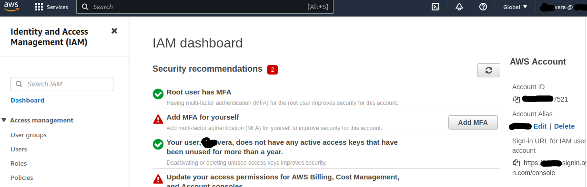
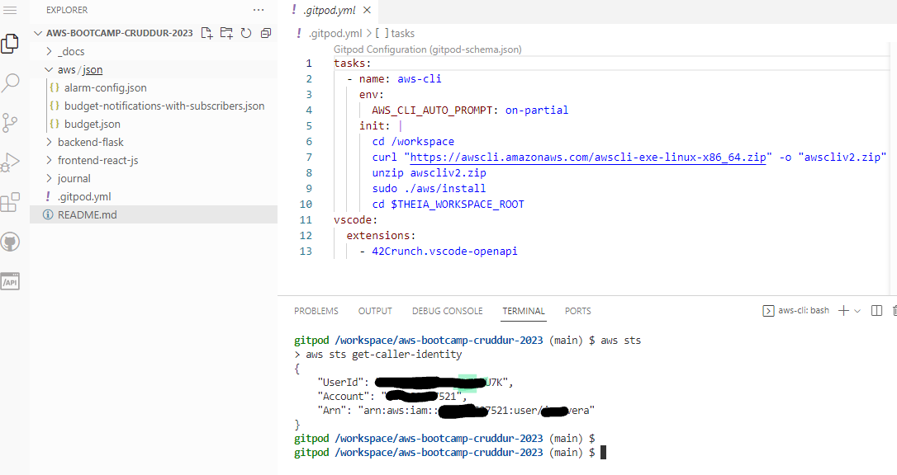
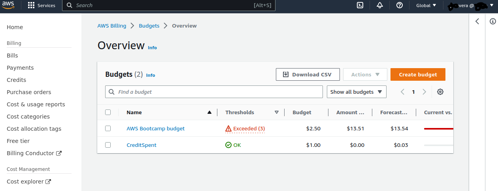

# Week 0 — Billing and Architecture

## Homework

### Recreate Conceptual Diagram

[Lucid - Conceptual Diagram](https://lucid.app/lucidchart/9326cca6-4e99-42b3-9d3b-8ad8952a33d2/edit?invitationId=inv_52d9efb9-98c0-4f5b-8751-f3cb60fe7a4d)

### Recreate Logical Architectual Diagram

[Lucid - Logical Diagram](https://lucid.app/lucidchart/6e93adb2-2967-42d5-8cfb-a7100ef63d38/edit?invitationId=inv_a6d5e712-ede7-4ea1-896e-f229d1fa9268)

### Create Admin User and Generate AWS Credentials

### Installed AWS CLI

I had to refresh my **AWS KEY** because I misplaced my previous secret. Either way, is good practice to rotate keys every year.

Commands to know:
* `aws sts get-caller-identity`
* Create Variable: `export VARIABLE_NAME =$`
* Copy variable to GP : `gp env VARIABLE_NAME`

### Create a Billing Alarm

### Create a Budget

