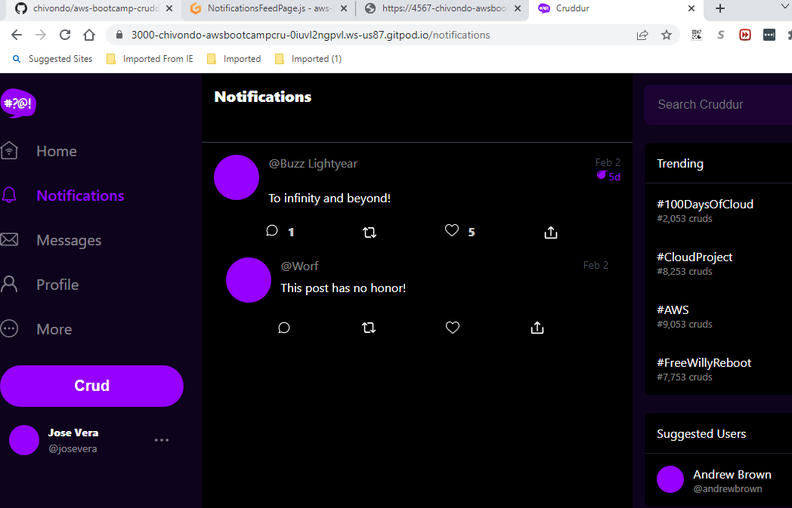
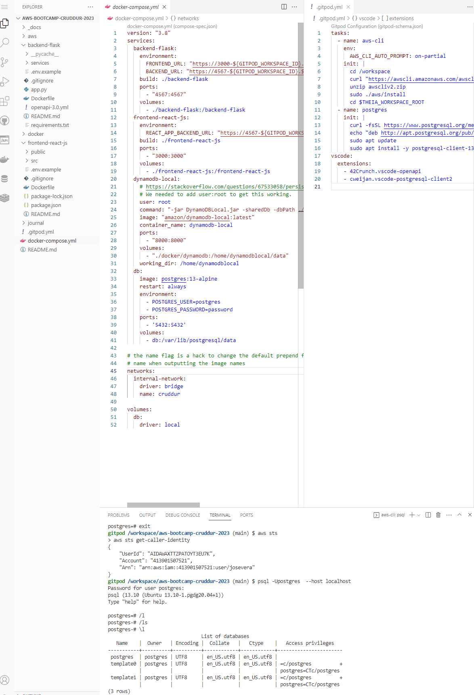

# Week 1 — App Containerization

## Required Homework

### Containerize Application (Dockerfiles, Docker Compose)
 - Create Dockerfile in the backend folder
 - Creat Dockerfile in th frontend folder
 - Create a YAML compose docker file in the main folder. This will allow you to run multi-containers with a single command.
### Document the Notification Endpoint for the OpenAI Document
Added the following code in the openapi-3.0.yml file
```
/api/activities/notifications:
    get:
      description: 'Return a feed of activity for all  of those that I follow'
      tags:
        - activities
      parameters: []
      responses:
        '200':
          description: Returns an array of activities
          content:
            application/json:
              schema:
                type: array
                items:
                  $ref: '#/components/schemas/Activity'
```

 ###  Write a Flask Backend Endpoint for Notifications
 Added the following code in the /backend-flask/app.py file
 
 ```
 @app.route("/api/activities/notifications", methods=['GET'])
def data_notifcations():
  data = NotificationsActivities.run()
  return data, 200
  ```
  
  After that, created a service file called "NotificationsActivities".
  
  ### Write a React Page for Notifications
  
  - Add the NotificationFeedPage in folder /frontend-react-js/src/App.js
  - Added new files NotificationsFeedPage.css and NotificationsFeedPage.js in folder frontend-react-js/src/pages/ 
 
 Final result of the webpage after all the changes in the notification FeedPage


### Run DynamoDB Local Container and ensure it works & Run Postgres Container and ensure it works

Finnaly we added DynamoDB and Postgres in our docker-compose file and make sure they work.




## Homework Challenges
 ### Run the dockerfile CMD as an external script
 I added the following code to the Docker file in the /backend-flask docker file
 
 ```
 COPY script.sh /script.sh
RUN chmod +x /script.sh

#CMD (Command)
#python3 -m flask run --host=0.0.0.0 --port=4567
ENTRYPOINT [ "/script.sh" ]
CMD []
 ```
 Added a script.sh file in the /backend-flask directory with the pytho3 command.
 
 ```
 #!/bin/bash
python3 -m flask run --host=0.0.0.0 --port=4567
 ```
