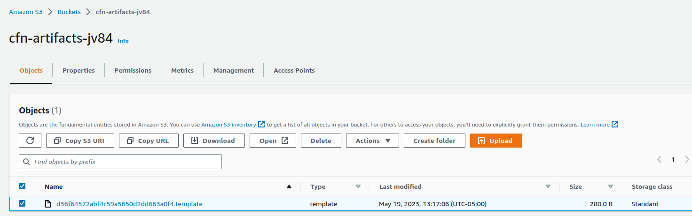
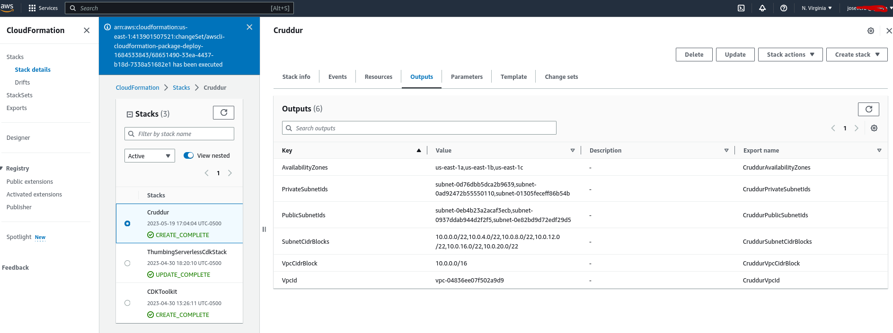
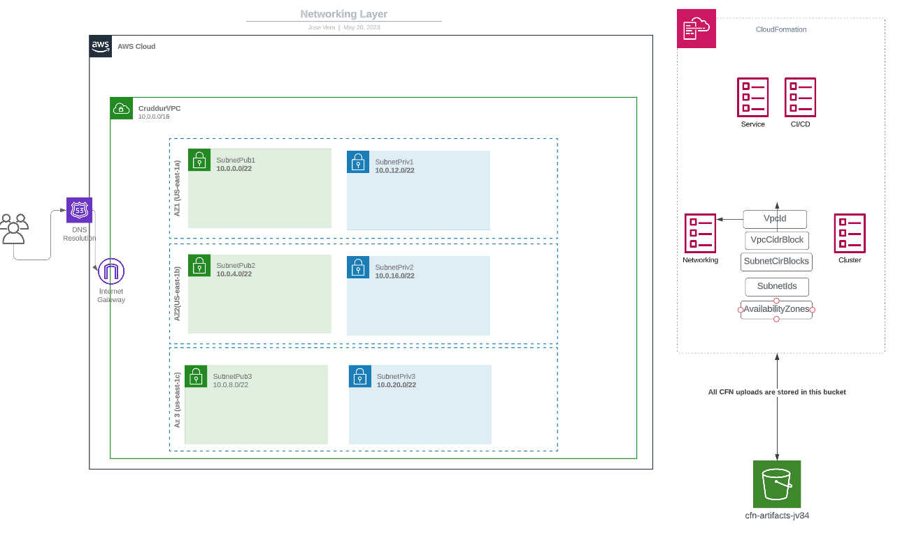

# Week 10 — CloudFormation Part 1

## Required homework

CloudFormation is AWS IaC tool and AWS manages it for you which is an advantage against Terraform.

CloudFormation can be written in JSON or YAML. We will use YAML for our project.

Create a cfn folder in our repo and start with the `template.yaml`. Is good idea to have the templates in your project.

MultiLayer architecture : Web tier ; Applications Tier; Database Tier

Find sample templates to figure out what is required for the AWS service - Eg: [ECS](https://docs.aws.amazon.com/AWSCloudFormation/latest/UserGuide/quickref-ecs.html#quickref-ecs-example-1.yaml)

Create a bin script to deploy the CFN.

After deploying, check in the AWS portal under Cloud Formation the change set to make sure everything is in order

CloudTrail is very good to check API event logs and check for error.

Install cfn-lint to check for errors `pip install cfn-lint`

CFN Guard is a Policy-as-Code `cargo install cfn-guard` . This is good to set up policy so users cannot create CFN templates agaisnt the policy. For example , setting up a S3  bucket to be always private. Users  will not be able to create a public  S3-bucket.

Create a unique name S3 bucket `cfn-artifacts-jv84` in AWS and add it to the Cloud formation portal. Include it in the deploy script with command `--s3-bucket "cfn-artifacts-jv84` and run the script.

The template will be saved in the S3 bucket.

### Networking layer

Create a new networking folder with file `template.yaml`. [Networking](link)
You need the following components:
* VPC
* IGW
* Route Table
* Subnets
* Outputs

Result in CloudFormation:

Networking Diagram - [NetDiagram](https://lucid.app/lucidchart/22207a1a-dae1-4147-8836-8a75f8a9419f/edit?viewport_loc=-342%2C7%2C2933%2C1394%2CWAPZBnZ3av3o&invitationId=inv_d6c467eb-15fa-4278-804e-7cb35cad388e)

### Cluster Layer

Create a Cluster template [Cluster](https://github.com/chivondo/aws-bootcamp-cruddur-2023/blob/main/aws/cfn/cluster/template.yaml)

Use Crossreference stack

Install cfn-toml `gem install cfn-toml`

CFN cluster created in CLoudFormation

