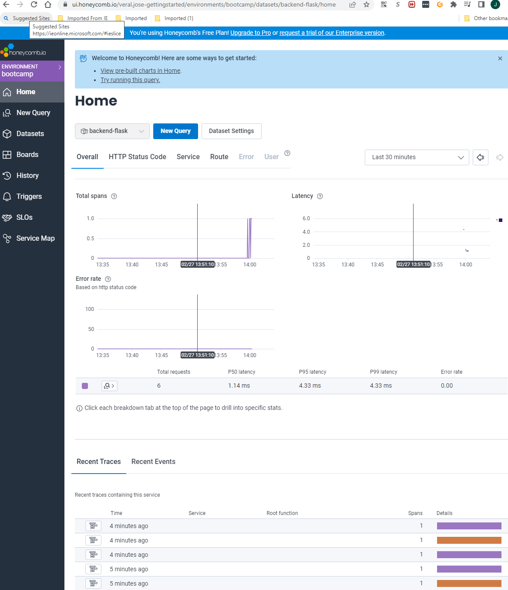
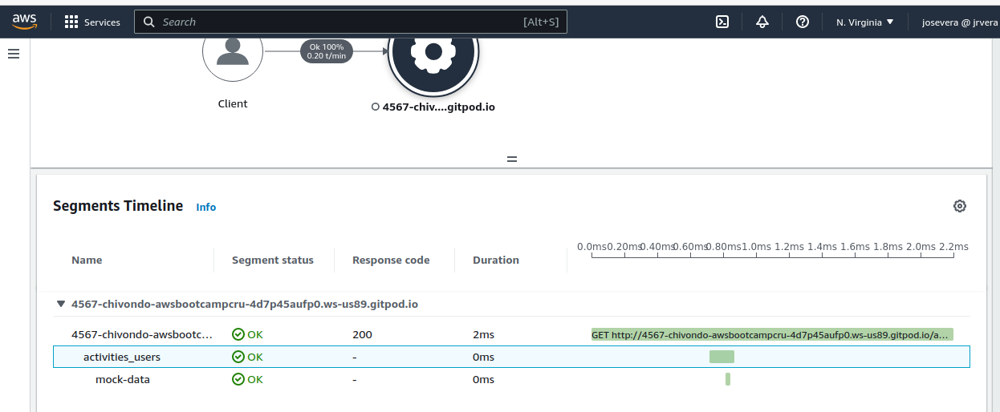
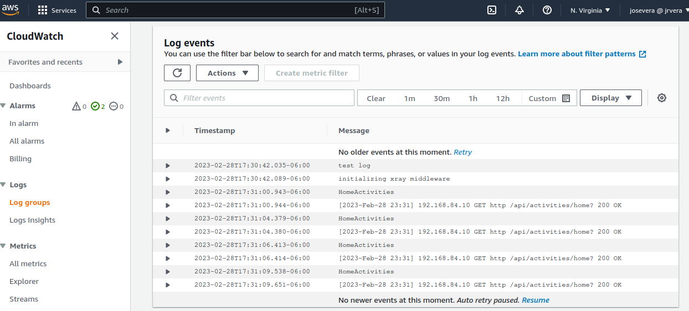
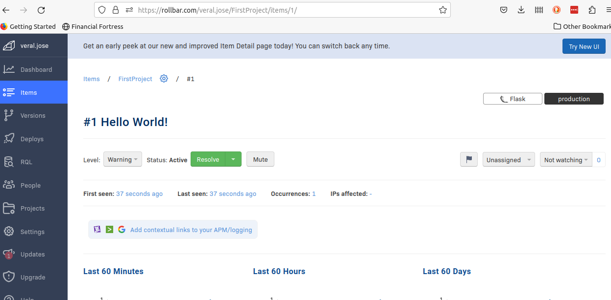
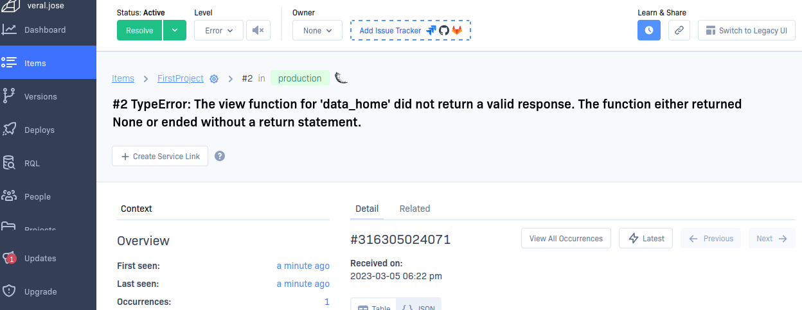

# Week 2 — Distributed Tracing

## Required Homework

### Instrument Honeycomb with OTEL
Honeycomb instrumentation is straight forward and requires setting up the OTEL commands. Make sure to use the service name you are trying to capture (like backend-flask). You can have multiple service name. Honeycomb is very good to watch the performance of your services and the latency between requests.

### Instrument AWS X-Ray and subsegments
Xrays are more complicated to instrument and requires the Xray daemon. Requires to create a subsegment to capture more logs.

### Configure custom logger to send to CloudWatch logs
After configuring customer logger, we can see in CloudWatch the logs. Notice the log *initializing xray middleware*, it comes from the command from the xrays function **XRayMiddleware(app, xray_recorder)** . Also added the *HomeActivities* by tagging it in the HomeActivities Service with the command **Logger.info("HomeActivities")**

### Integrate Rollbar and capture an error
 Rollbar is very good to capture errors. 

Error

