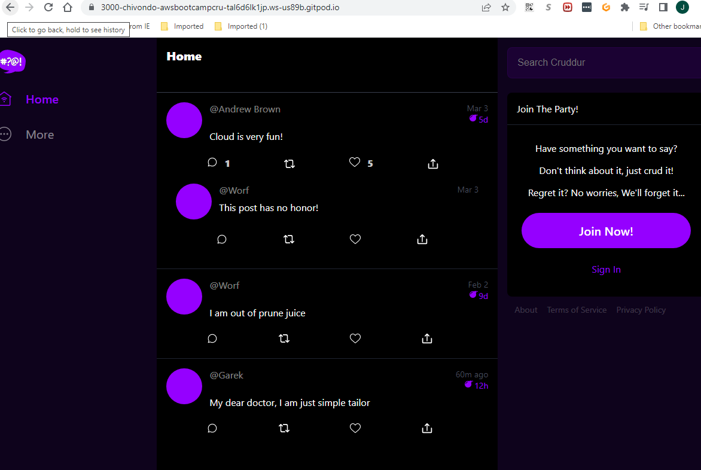

# Week 3 — Decentralized Authentication

## Required Homework

### Set up Cognito User Pool
1. Created a Cognito user Pool in AWS.
sd

2. The Cognito User Pool ID and the Client ID needs to be added in the docker-compose file a environment variables.

```
AWS_COGNITO_USER_POOL_ID: "us-east-1_WnkSH6JKy"
AWS_COGNITO_USER_POOL_CLIENT_ID: "3k4tj2dvb7e2nknr9a7gnncou7"
```
### Implement Custom Signin Page
Following was added in the main App.js to add the signin cognito code.
```
import { Amplify } from 'aws-amplify';

Amplify.configure({
  "AWS_PROJECT_REGION": process.env.REACT_APP_AWS_PROJECT_REGION,
  "aws_cognito_identity_pool_id": process.env.REACT_APP_AWS_COGNITO_IDENTITY_POOL_ID,
  "aws_cognito_region": process.env.REACT_APP_AWS_COGNITO_REGION,
  "aws_user_pools_id": process.env.REACT_APP_AWS_USER_POOLS_ID,
  "aws_user_pools_web_client_id": process.env.REACT_APP_CLIENT_ID,
  "oauth": {},
  Auth: {
    // We are not using an Identity Pool
    // identityPoolId: process.env.REACT_APP_IDENTITY_POOL_ID, // REQUIRED - Amazon Cognito Identity Pool ID
    region: process.env.REACT_APP_AWS_PROJECT_REGION,           // REQUIRED - Amazon Cognito Region
    userPoolId: process.env.REACT_APP_AWS_USER_POOLS_ID,         // OPTIONAL - Amazon Cognito User Pool ID
    userPoolWebClientId: process.env.REACT_APP_CLIENT_ID,   // OPTIONAL - Amazon Cognito Web Client ID (26-char alphanumeric string)
  }
});
```
### Implement Custom Signup Page
1. Added the following code in the SignupPage.js

```
import { Auth } from 'aws-amplify';
  setErrors('')
    try {
        const { user } = await Auth.signUp({
          username: email,
          password: password,
          attributes: {
              name: name,
              email: email,
              preferred_username: username,
          },
          autoSignIn: { // optional - enables auto sign in after user is confirmed
              enabled: true,
          }
        });
        console.log(user);
        window.location.href = `/confirm?email=${email}`
    } catch (error) {
        console.log(error);
        setErrors(error.message)
    }
    return false
```
### Implement Custom Confirmation Page
Screenshot of the result shown after the configuration of the ConfirmationPage.js 


### Implement Custom Recovery Page


### Adding backend check token

After adding the token in the backend. We added the following code to check if the token is being authenticade then it will show the message after sign in.
```
 if cognito_user_id != None:
        extra_crud = {
          'uuid': '248959df-3079-4947-b847-9e0892d1bab4',
          'handle':  'Lore',
          'message': 'My dear brother, it the humans that are the problem',
          'created_at': (now - timedelta(hours=1)).isoformat(),
          'expires_at': (now + timedelta(hours=12)).isoformat(),
          'likes': 1042,
          'replies': []
        }
        results.insert(0,extra_crud)
 ```


After we signed out, the message no longer should show in the homepage because the user is not authenticaded.


