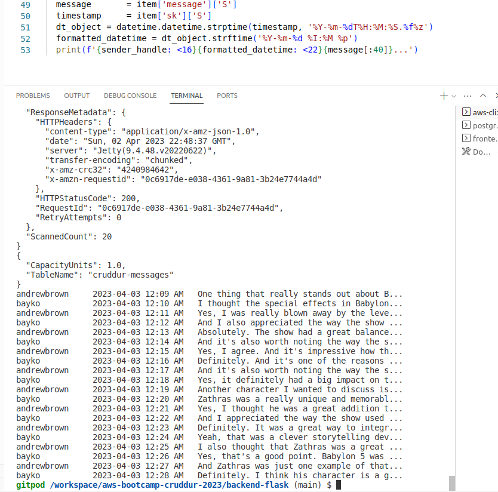
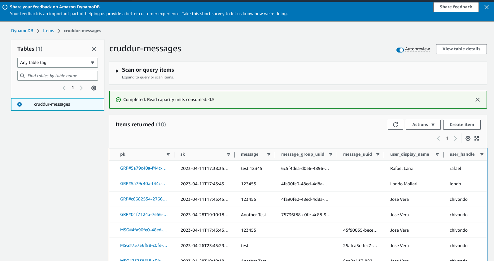

# Week 5 — DynamoDB and Serverless Caching

## Required Homework

### Watched Week 5 - Data Modelling (Live Stream)

Dynamo DB is a NoSQL database that is not relational and doesn't use SQL to query data. The concept is to use a single table for all the data. It has a key and a value. And is stored as a nested data structure. There are no joins in DynamoDB, you need to plan for a flat table. NoSQL are fast, inexpensive, and scalable.

We need to figure out:
* What data do I need
* When do I need it
* How quickly can I get

Try to pre-plan consistently by modeling the data in a diagram before creating and dumping data in the table. 

We are using DynamoDB in this project for the message systems.
We have 2 screens the Message Group and the Conversation.
For the Message group, and access pattern is to show all conversations, from who and needs to be sorted in descending order.
On the Conversations, the access pattern is all the conversations.

Is recommended to use structure SQL while modeling your data. That way is easier to see what you're trying to map and also there is a way to do queries in DynamoDB with "Partiql"
Model your NoSQL database on how the application wants to interact with that data.
Single table design reduces complexity and you can access your data with a single query. 
A query requires a partition Key and the Sort Key is optional. In most cases, you will use query instead of a scan.

GSI vs LSI. In this project, we are using GSI.

DDb Data Modeling:
| pk                       | sk (create_at or last_reply_at) | display_name (aka other_user_display_name) | handle (aka other_user_handle) | message (aka last_message) | user_uuid | message_group_uuid |
|------------------------- | ------------------------------- | ------------------------------------------ | ------------------------------ | -------------------------- | --------- | ------------------ |
| MSG#{message_group_uuid} | MSG#{created_at}                | Jose Vera | chivondo | Test 123 | 94324355-423432423-43243-43243 | 23423534-423423-2342423 |
| GRP#{my_user_uuid} | GRP#{last_reply_at} | Rafael | rafael | Cool beans | 2345566-4342342-423423-423423 | 23423534-423423-2342423 |
| GRP#{my_user_uuid} | GRP#{last_reply_at} | Jose Vera | chivondo | Test 123 | 94324355-423432423-43243-43243 | 23423534-423423-2342423 |


**Access Pattern A** Conversation
**Access Pattern B** List of conversation
**Access Pattern C** Create a message
**Access Pattern D** Update a group message from the last message


### Watched Ashish's Week 5 - DynamoDB Considerations
Security Best Practices - AWS 
* Use VPC endpoints: Create private network from your application or lambda to DynamoDB. Helps prevent unauthorized access from the internet.
* Compliance standard is what your business requires.
* DynamoDB should only be in the AWS region that you are legally allowed to be holding user data in.
* Amazon organizations SCP - to manage DynamoDB table deletion, DynamoDB creation, region lock etc.
* AWS Cloudtrail is enabled & monitored to trigger alerts on malicious DynamoDB behavior by an identity in AWS.
* AWS Config Rules is enabled in the account and region of DynamoDB
Security Best Practices - Application
* DynamoDB to use appropiate Authentication - Use IAM roles/AWS Cognito Identity pool - Avoid IAM Users/Groups
* DYnamoDB User lifecycle Management - Create, Modify, Delete Users
* AWS IAM roles instead of individual users to access and manage DynamoDB
* DAX Service (IAM) Role to have Read-only access to DynamoDB (If possible)
* Not have DynamoDB be accessed from the internet ( use VPC Endpoints)
* Site to Site VPN or Direct Connect for On-premise and DynamoDB access
* Client-side encryption is recommended by Amazon for DynamoDB.

### Implement Schema Load Script
Add [boto3](https://boto3.amazonaws.com/v1/documentation/api/latest/index.html) SDK to your list of requirements.txt
`pip install -r requirements.txt`

Implement [schema-load](https://github.com/chivondo/aws-bootcamp-cruddur-2023/blob/main/bin/ddb/schema-load) using Boto3 - `/ddb/schema-load`
This is where you add the attributes of your table

Create [list-tables](https://github.com/chivondo/aws-bootcamp-cruddur-2023/blob/main/bin/ddb/list-tables) script. `bin/ddb/list-tables`

Create ddb [drop](https://github.com/chivondo/aws-bootcamp-cruddur-2023/blob/main/bin/ddb/drop) table script `bin/ddb/drop`

### Implement Seed Script

Create ddb [seed](https://github.com/chivondo/aws-bootcamp-cruddur-2023/blob/main/bin/ddb/seed) script `bin/ddb/drop`
Implement the access pattern in this script
* Create message
* Create message group
* Get user uuids  `get_user_uuids()` . Retreat users from database and assign them to variables.


### Implement Scan Script

Create ddb [scan](https://github.com/chivondo/aws-bootcamp-cruddur-2023/blob/main/bin/ddb/scan) script `bin/ddb/scan` This will only work locally since scans can be expensive on production in the cloud.

### Implement Pattern Scripts for Read and List Conversations
Create [get-conversation](https://github.com/chivondo/aws-bootcamp-cruddur-2023/blob/main/bin/ddb/patterns/get-conversation) script. `/ddb/patterns/get-conversation`
Create [list-conversation](https://github.com/chivondo/aws-bootcamp-cruddur-2023/blob/main/bin/ddb/patterns/list-conversation) script. `ddb/patterns/list-conversation` Access pattern to show the conversation between two users




### Implement Update Cognito ID Script for Postgres Database

Create cognito [list-users](https://github.com/chivondo/aws-bootcamp-cruddur-2023/blob/main/bin/cognito/list-users). `bin/cognito/list-users` With this script we get the sub and handle (preferred_username) of our users.

Create [update_cognito_user_ids](https://github.com/chivondo/aws-bootcamp-cruddur-2023/blob/main/bin/db/update_cognito_user_ids). `/bin/db/update_cognito_users_ids`

Create [ddb.py](https://github.com/chivondo/aws-bootcamp-cruddur-2023/blob/main/backend-flask/lib/ddb.py) library. `backend-flask/lib/ddb.py` We use stateless class compared to the db.py lib

Create [message_groupss.py](https://github.com/chivondo/aws-bootcamp-cruddur-2023/blob/main/backend-flask/services/message_groups.py) service. `services/message_groups.py`

Create [uuid_from_cognito](https://github.com/chivondo/aws-bootcamp-cruddur-2023/blob/main/backend-flask/db/sql/users/uuid_from_cognito_user_id.sql) sql file. `backend-flask/sql/users/uuid_from_cognito_user_id.sql`

Add the bearer token in the pages that require authentication. ```headers: { 'Authorization': `Bearer ${access_token}` ```


### Implement (Pattern A) Listing Messages in Message Group into Application

### Implement (Pattern B) Listing Messages Group into Application

### Implement (Pattern C) Creating a Message for an existing Message Group into Application

### Implement (Pattern D) Creating a Message for a new Message Group into Application

### Implement (Pattern E) Updating a Message Group using DynamoDB Streams



