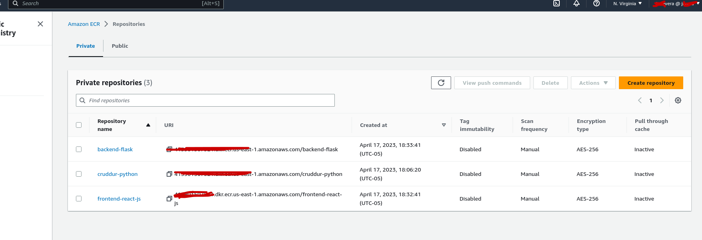
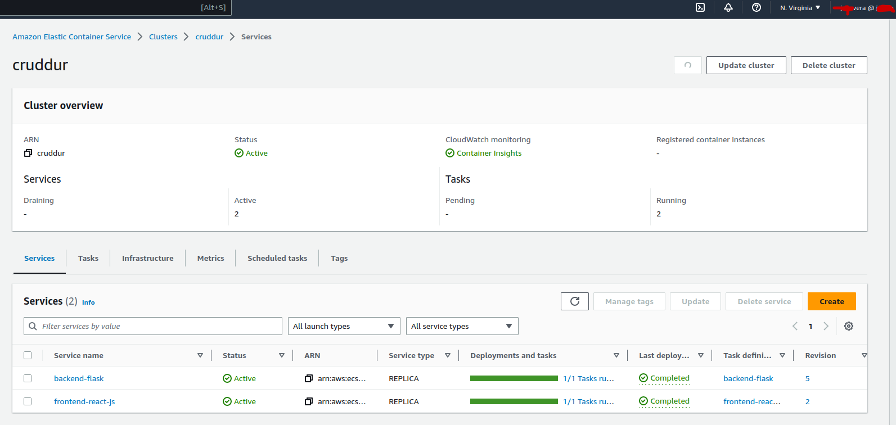
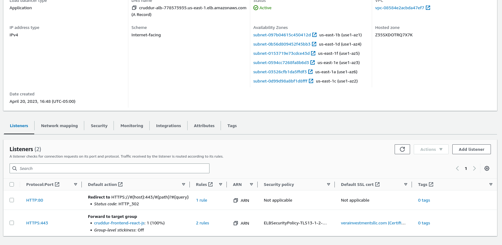
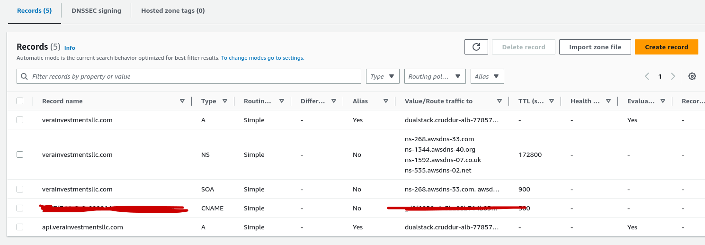
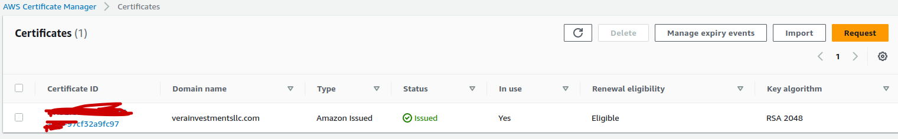

# Week 6 — Deploying Containers

## Required Homework

### Watch ECS Security by Ashish
**Security Challenges with AWS Fargate**
- No visibility of infrastructure
- Ephemeral resources makes it hard to do triage or forensics for detected threats
- No file/network monitoring
- Cannot run traditional Security Agents in Fargate
- User can run unverified Container images
- Container can run as root and even with elevated priviledges

### Watch Fargate Technical Questions with Maish
Learned the following :
- One process per container
- How many CPUs cycles per container are you using.
- Use Sane default for your webserver. Leverage the cloud providers feature to manage security and container processes.
- Use care for bridge networking mode is to use multiple containers on the same port number on the ec2 instance.
- Copilot is a tool to easily provision containers.
- Envoy


### Provision ECS Cluster
Create a ESC Cluster
```
aws ecs create-cluster \
--cluster-name cruddur \
--service-connect-defaults namespace=cruddur
```

### Create ECR repo and push image for backend-flask
First I logged in into the ecr:
`aws ecr get-login-password --region $AWS_DEFAULT_REGION | docker login --username AWS --password-stdin "$AWS_ACCOUNT_ID.dkr.ecr.$AWS_DEFAULT_REGION.amazonaws.com"`

Create REPO
```
aws ecr create-repository \
  --repository-name backend-flask \
  --image-tag-mutability MUTABLE
```
Set the URL as a variable
```
export ECR_BACKEND_FLASK_URL="$AWS_ACCOUNT_ID.dkr.ecr.$AWS_DEFAULT_REGION.amazonaws.com/backend-flask"
echo $ECR_BACKEND_FLASK_URL
```
Build Image

`docker build -t backend-flask .`

Tag Image

`docker tag backend-flask:latest $ECR_BACKEND_FLASK_URL:latest`

And the last step is to push

`docker push $ECR_BACKEND_FLASK_URL:latest`

### Deploy Backend Flask app as a service to Fargate

First is needed to pass the Sensitive data using the SSM put-parameter to our task definition.

Created JSON file for out task definitions. This JSON file contains the configuration of the containers and the environment variables.

You can deploy the Container with Fargate via the ECS (Elastic Container Service) UI using the create service and select the backend image to launch. Or using the command `aws ecs create-service --cli-input-json file://aws/json/service-backend-flask.json`

The _service-backend-flask.json_ file contains configuration parameter of your service (like subnet, security and target group)


### Create ECR repo and push image for fronted-react-js
Same steps done in the backend-flask are done for the frontend-react-js. 



### Deploy Frontend React JS app as a service to Fargate
Same Steps done for backend but with the FrontEnd image



### Provision and configure Application Load Balancer along with target groups
Set up 2 target groups when provisioning and configure the ALB, one for the backend and another for the frontend.

#### ALB


#### Target Groups


### Manage your domain using Route53 via hosted zone



### Create an SSL cerificate via ACM

Request a SSL certificate using the AWS Certificate Manager. It has to be public 



### Setup a record set for naked domain to point to frontend-react-js

* verainvestmentsllc.com A record is routed to your ALB application.
*  In the ALB application set up listener Port 80 to redirect it to HTTPS
* In the ALB application set up listener Port 443 to forward to the cruddur-frontend-react-js-tg


### Setup a record set for api subdomain to point to the backend-flask
* Create record for api.verainsvestmentsllc.com
* If domain is api.verainvestmentsllc.com then forward to target group backend-flask-tg

### Configure CORS to only permit traffic from our domain

### Secure Flask by not running in debug mode

 - Add the --debug parameter in the CMD []  at the dev Dockerfile 
 - Add ` "--no-debug", "--no-debugger", "--no-reload"` in the Dockerfile.prod

### Implement Refresh Token for Amazon Cognito

### Refactor bin directory to be top level

Use command `mv backend-flask/bin ..` to move entire folder to the work project. Need to make sure every path in the script file are fixed.

### Configure task defintions to contain x-ray and turn on Container Insights

Add following to task-definition under container
```
  {
        "name": "xray",
        "image": "public.ecr.aws/xray/aws-xray-daemon" ,
        "essential": true,
        "user": "1337",
        "portMappings": [
          {
            "name": "xray",
            "containerPort": 2000,
            "protocol":"udp"
          }
          ]
      },
```

### Change Docker Compose to explicitly use a user-defined network

Add the following near the end in the docker compose file:
```
networks: 
  cruddur-net:
    driver: bridge
    name: cruddur-net
```
The networks cruddur-net needs to be added to every container in the docker compose file

### Create Dockerfile specfically for production use case

Create a Dockerfile.prod for the backend and frontend

### Using ruby generate out env dot files for docker using erb templates

Create Ruby script- This will create a file with env variables used by our containers locally. Point the docker-compose file to the file created by the script. Add the commnad to run the Ruby script in the gitpod.yml `ruby "$THEIA_WORKSPACE_ROOT/bin/backend/generate-env"`
```
#!/usr/bin/env ruby

require 'erb'

template = File.read 'erb/backend-flask.env.erb'
content = ERB.new(template).result(binding)
filename = "backend-flask.env"
File.write(filename, content)
```
