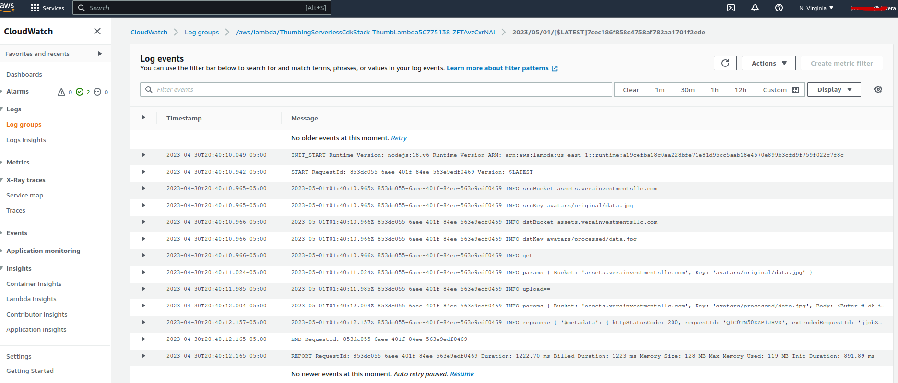
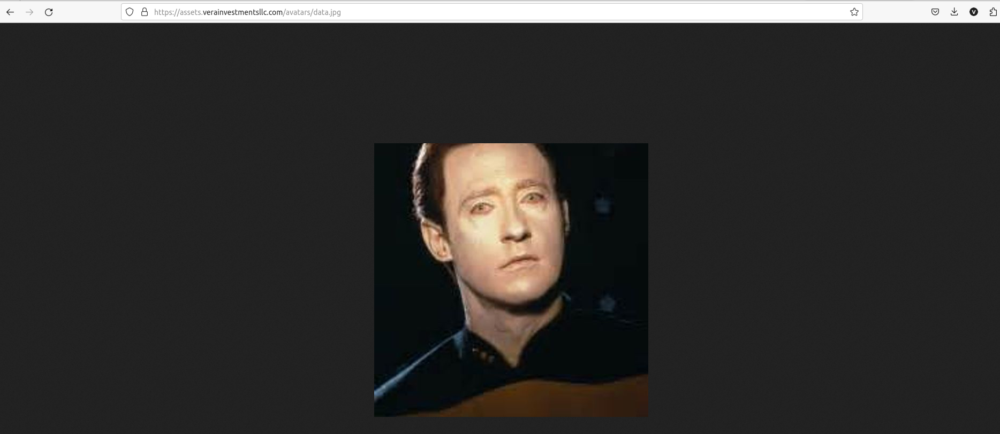
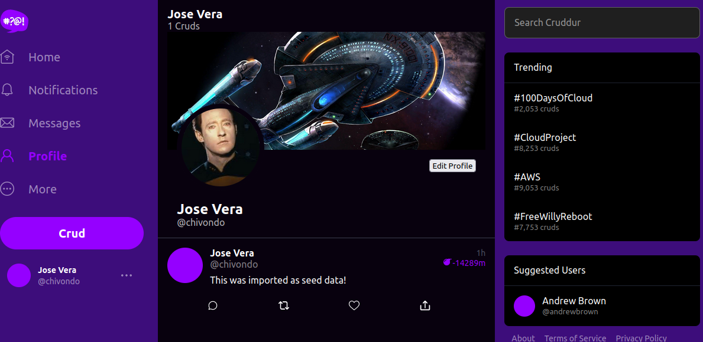
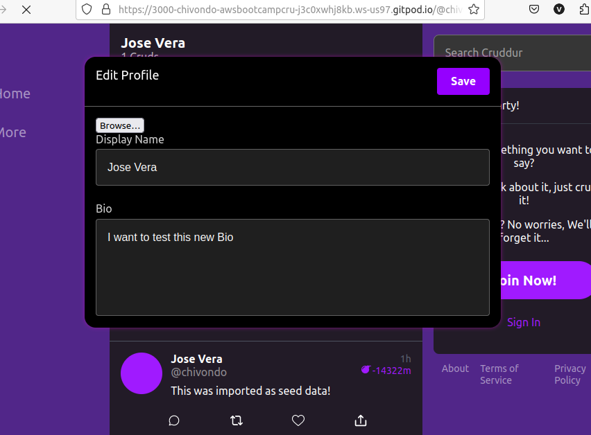
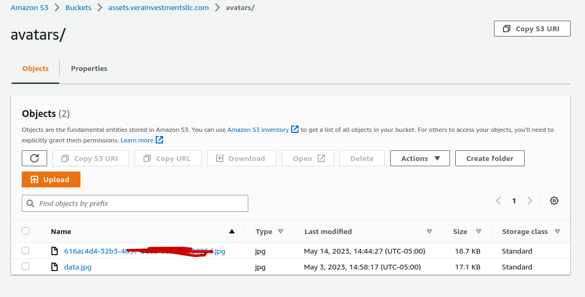
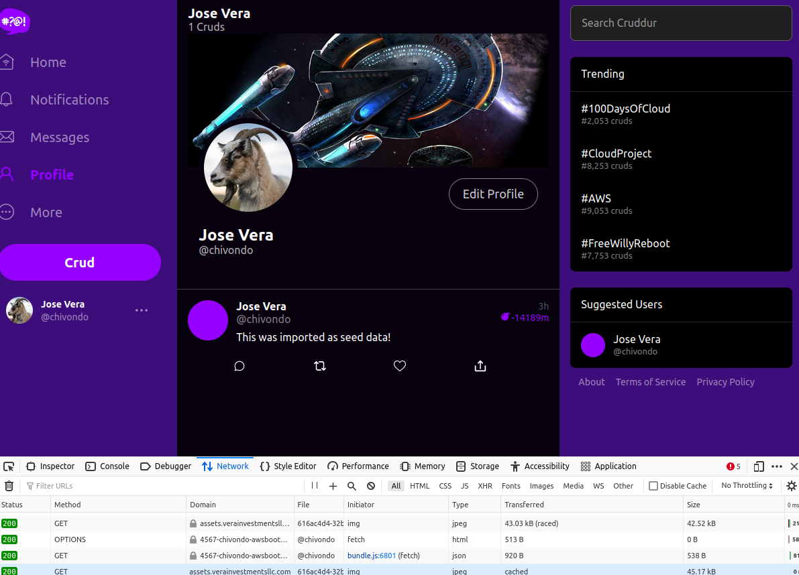

# Week 8 — Serverless Image Processing

CDK is IaC tool. 

Check The CDK Book and CDK Day for more information and learning.

## Required Homework

### Implement CDK (Cloud Development Kit) Stack

Most of our code will live in the lib folder and we are using typescript for the CDK code.

#### Create bucket

We are using import function instead of creating a bucket to add a layer of protection to not delete the bucket when we destroy the CDK.

`const bucket = this.importBucket(bucketName);`

#### Create Lambda function

Need to create .env file. The since the .env file might contain confidential information then it cannot be committed to the github. Create a new file .env.example and copy it at the start in your gitpod.yml .

```
cd thumbing-serverless-cdk
cp .env.example .env
```
Use sharp js for your lambda function to process the image.  `npm install sharp`
In addition since we are using AWS Lambda then the following needs to be installed:
``` sh
npm install
rm -rf node_modules/sharp
SHARP_IGNORE_GLOBAL_LIBVIPS=1 npm install --arch=x64 --platform=linux --libc=glibc sharp
```
`  const lambda = this.createLambda(functionPath, bucketName, folderInput, folderOutput);`

#### Create S3 Event Notification to Lambda

```
   this.createS3NotifyToLambda(folderInput,lambda,bucket)
   this.createS3NotifyToSns(folderOutput,snsTopic,bucket)
```    

#### Create SNS topic

```
 const snsTopic = this.createSnsTopic(topicName)
 this.createSnsSubscription(snsTopic,webhookUrl)
```

#### Create policies and attach them to your lambda

```
 const s3ReadWritePolicy = this.createPolicyBucketAccess(bucket.bucketArn)
  lambda.addToRolePolicy(s3ReadWritePolicy);
```


#### Commands to know: 
* Quickly check your code for errors `cdk synth`
* Bootstrapping `cdk bootstrap "aws://$AWS_ACCOUNT_ID/$AWS_DEFAULT_REGION"`
* Deploy `cdk deploy`

After implementing our CDK. We can upload our images using serverless image process and check the logs.



### Serve Avatars via CloudFront

Need to create a new record in your hosted zone assets.domain.com to Cloudfront alias

Update policies in the s3 bucket to allow cloudfront.

Create new bucket "cruddur-uploaded-avatars-jv84" for the original image and use the existing assets bucket for the processed image. That way it adds an extra layer of security. 

Update scripts and thumbing cdk file to match the 2 buckets. One for upload folder and another for the assets folder.


We can access the processed image on the web


### Implement Users Profile Page

Create users SQL template -> show.sql

Create EditProfileButton

Modify HomeFeedPage.js ; NotifcationsFeedPage.js; UserFeedPage.js

Add ProfileHeading.js and ProfileHeading.css  . This will reside our profile image, banners and handle. 

Modify ProfileHeading.css to display aesthetically in our website.

"Ad block" needs to be disabled in order for the banner to show up

End Result:




### Implement Users Profile Form
Modify app.py to add a update_profile route.

Add update_profile.py in the service folder

Create `ProfileForm.js` and `ProfileForm.css`  .This is where the Bio and the upload avatar image resides.


### Implement Backend Migrations
* Create `update.sql`
* Create a migration script file under bin
* Create migrate script file under db
* Create rollback script file under db
* Update db.py
* 

### Presigned URL generation via Ruby Lambda
* Create ruby function to upload images to presigned url.
- Create gem file and add requirements `bundle install`
- Execute file `bundle exec ruby function.rb`
- Create JWT authorizer
   - Make sure to install `npm install aws-jwt-verify --save` and save it with a zip file in your Lambda function. And double check the node_modules are there.
   - Used Solution from `@beiciliang` for LambdaAuthorizer to work.
* Create API Gateway
* 
### HTTP API Gateway with Lambda Authorizer
* Create HTTP API gateway api.<your-domain>.com
   2 Routes:
      Method POST: /avatar/key_upload. Attach authorization to CruddurAPIGatewayLAmbdaAuthorizer. Attach integration to CruddurAvatarUpload.
      Method OPTIONS: /{proxy+}. Attach only intergration to Cruddur AvatarUpload.
   
### Create JWT Lambda Layer

   Image with cognito ID shows in the assets folder:
  
   
### Render Avatars in App via CloudFront
   * Create ProfileAvatar.js
   * Modify ProfileInfo.js to render avatar
   
 
   
