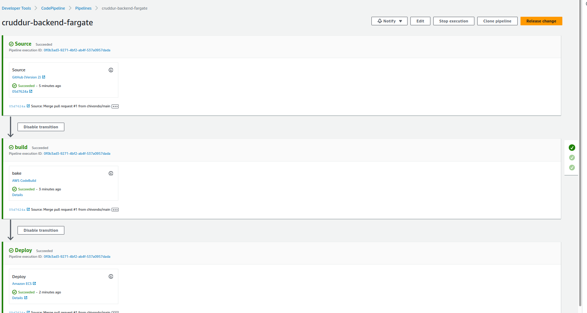

# Week 9 — CI/CD with CodePipeline, CodeBuild and CodeDeploy

Many ways to do this. We will focus with CodePipeline, the idea is to automate pushing and deploying images.

Artifact is to store 

## Required Homework

### CICD Pipeline Security

### Configuring CodeBuild Part 1

Create a Pipelin with Default location and Default AWS Managed key. Use GitHub (Version 2) and connect to your repo.
Create a new branch in your github. Checked "Start the pipeline on source code change" and use CodePipeline default
Use Amazon ECS for deployment and pick your images from Fargate
Build a CodeBuild project. 
Do not select a VPC setting
Create buildspec.yml for the CodeBuild configuration

### Configuring CodeBuild Part 2

Go to Pull request and create Pull request `main -> prod `

First build failed because I was missing a policy. I created a Policy [CodeBuildECR](https://github.com/chivondo/aws-bootcamp-cruddur-2023/blob/main/aws/policies/CodeBuildECR) needed and attached it to my codebuild-cruddur-backend role.

After that I was able to build the CodeBuild sucessfully.

### Configuring CodePipeline
Add build stage
Output image for the build stage is `ImageDefinition`
Input image for the deploy stage is `ImageDefinition`
Click `Release change`

Check our backend health check to see if its running:

Modify health check to a new version in our `app.py` file.

We make a new pull-merge from Prod

New health-check version deployed

New deploy took around 14 min from the merge pull to full deploy

